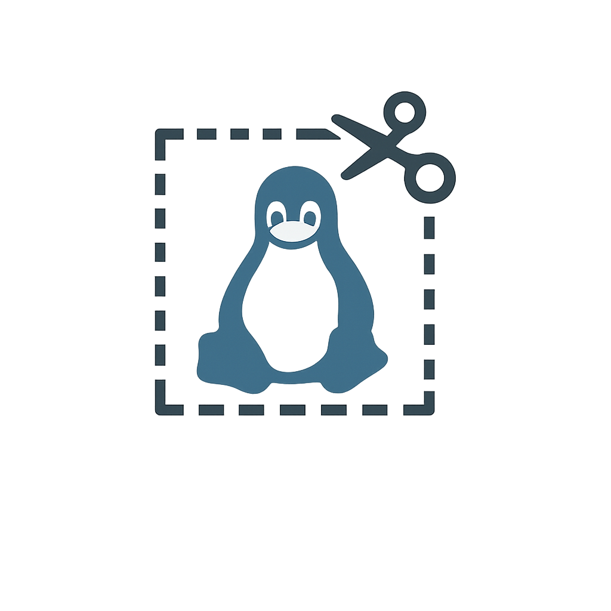

# Snip Tool

A simple and intuitive snipping tool for Linux that allows you to take screenshots of selected areas and automatically copies them to your clipboard. Features a clean interface with visual feedback and custom branding.



## Features

- 🖱️ **Click and drag** to select screenshot area
- 📋 **Automatic clipboard** integration
- 🎨 **Visual feedback** with darkened overlay and bright selection
- ⌨️ **Keyboard shortcut** support (Ctrl+Shift+S)
- 🎯 **Clean, minimal** interface
- 🖼️ **Custom branding** with integrated logo
- 📦 **Professional packaging** as .deb file

## Installation

### Method 1: Install from GitHub Release (Recommended)

1. **Download the latest .deb package** from the [Releases page](https://github.com/rajofearth/snip/releases/latest)
   ```bash
   # Download the latest release
   wget https://github.com/rajofearth/snip/releases/latest/download/snip-tool_*.deb
   ```

2. **Install the package**:
   ```bash
   sudo dpkg -i snip-tool_*.deb
   sudo apt-get install -f  # Fix any missing dependencies
   ```

3. **Set up the keyboard shortcut**:
   ```bash
   snip-tool --setup-shortcut
   ```

   > 💡 The shortcut will be set to `Ctrl+Shift+S` by default. You can change it in your system settings if needed.

### Method 2: Build from Source

1. **Clone the repository**:
   ```bash
   git clone https://github.com/rajofearth/snip.git
   cd snip
   ```

2. **Install build dependencies**:
   ```bash
   sudo apt-get install -y debhelper dh-make build-essential
   ```

3. **Build the .deb package**:
   ```bash
   ./build-deb.sh
   ```

4. **Install the package** (from the built .deb file):
   ```bash
   sudo dpkg -i snip-tool_*.deb
   sudo apt-get install -f  # Fix any missing dependencies
   ```

5. **Set up the keyboard shortcut**:
   ```bash
   snip-tool --setup-shortcut
   ```

### Method 3: Installation Script (Legacy)

1. Make the installation script executable:
   ```bash
   chmod +x install.sh
   ```

2. Run the installation script with `sudo`:
   ```bash
   sudo ./install.sh
   ```

## Dependencies

The following packages are automatically installed with the .deb package:

- `python3` - Python runtime
- `python3-tk` - Tkinter GUI library
- `python3-pil` - Python Imaging Library (Pillow)
- `python3-pil.imagetk` - PIL ImageTk module
- `scrot` - Screenshot utility
- `xclip` - Clipboard utility

## Usage

### Launch Methods

- **Application Menu:** Search for "Snip Tool" in your application launcher
- **Terminal:** Run `snip-tool`
- **Keyboard Shortcut:** Press `Ctrl+Shift+S` (after setup)

### How It Works

1. Launch the tool using any of the methods above
2. Your screen will be overlaid with a darkened interface
3. Click and drag to select the area you want to capture
4. The selected area will appear bright while the rest remains darkened
5. Release the mouse button to capture the selection
6. The screenshot is automatically copied to your clipboard
7. Press `Escape` to cancel at any time

## Command Line Options

```bash
snip-tool --help              # Show help message
snip-tool --version           # Show version information
snip-tool --setup-shortcut    # Set up keyboard shortcut
```

## Desktop Environment Support

Keyboard shortcut setup is supported for:
- **GNOME** (Ubuntu, Fedora, etc.)
- **Cinnamon** (Linux Mint)
- **KDE/Plasma** (Kubuntu, openSUSE, etc.)
- **XFCE** (manual setup instructions provided)

## Uninstallation

### For .deb Package
```bash
sudo apt remove snip-tool
```

### For Script Installation
1. Make the uninstallation script executable:
   ```bash
   chmod +x uninstall.sh
   ```

2. Run the uninstallation script with `sudo`:
   ```bash
   sudo ./uninstall.sh
   ```

## Building from Source

If you want to build the .deb package yourself:

1. **Clone or download the source code**
2. **Build the package:**
   ```bash
   ./build-deb.sh
   ```
3. **Install the generated package:**
   ```bash
   sudo dpkg -i snip-tool_1.0.0_all.deb
   ```

## Troubleshooting

### Keyboard Shortcut Not Working

1. Try setting up the shortcut manually:
   ```bash
   snip-tool --setup-shortcut
   ```

2. If automatic setup fails, configure manually in your system settings:
   - **GNOME/Ubuntu:** Settings → Keyboard → Custom Shortcuts
   - **KDE/Plasma:** System Settings → Shortcuts → Custom Shortcuts
   - **XFCE:** Settings → Keyboard → Application Shortcuts
   - Set shortcut: `Ctrl+Shift+S`
   - Set command: `snip-tool`

### Dependencies Missing

If you encounter dependency issues:
```bash
sudo apt-get update
sudo apt-get install python3 python3-tk python3-pil python3-pil.imagetk scrot xclip
```

### Permission Issues

If the tool doesn't launch, check permissions:
```bash
sudo chmod +x /usr/local/bin/snip-tool
```

## Contributing

Contributions are welcome! Please feel free to submit issues, feature requests, or pull requests.

## License

This project is open source. Feel free to use, modify, and distribute as needed.

## Version History

- **v1.0.0** - Initial release with .deb packaging
  - Professional .deb package distribution
  - Enhanced keyboard shortcut setup
  - Custom logo integration
  - Command line argument support
  - Multi-desktop environment support
